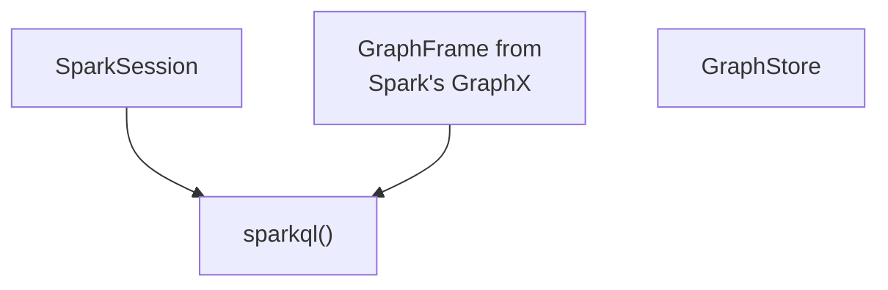
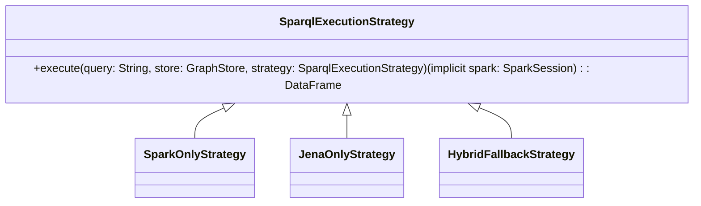

# Spark Semantic Web

This project is split into a library and an example application using that library.

The intention of this project is to explore the possibility of using Apache
Spark's query optimizations to speed up SparkQL queries.

## The App

Shows example usage of the library's `sparkql()` implementation.

You run it by executing `sbt app/run`.

## The Library

Introduces a `sparql()` to the Apache Spark context.

The implementation of `sparql()` takes a sparql query and runs it through
Apache Spark if it doesn't contain, currently, unsupported features.
Otherwise,
the execution is handled by Apache Jena.

THe end goal is that Apache Jena will never have to be used to execute SparQL.
Instead, it will be executed entirely self-sufficiently by Apache Spark.

# Design

The high-level API looks like this:

```scala
def sparql(query: String,
           graphStore: GraphStore,
           strategy: SparqlExecutionStrategy = HybridFallbackStrategy): DataFrame = {
  strategy.execute(query, graphStore)(spark)
}
```

## GraphStore

The GraphStore is defined like so:

```scala
trait GraphStore {
  /** Get a graph by name; error or Option if not found */
  def getGraph(name: String): Option[GraphFrame]

  /** Register or replace a named graph */
  def putGraph(name: String, graph: GraphFrame): Unit

  /** Remove a named graph */
  def removeGraph(name: String): Unit

  /** List all registered graph names */
  def listGraphs(): Seq[String]
}
```

The reasoning behind this design:

- enable plugging in any solution for storing Graphs, including mocks
- Mimic how the SQL view registration works




